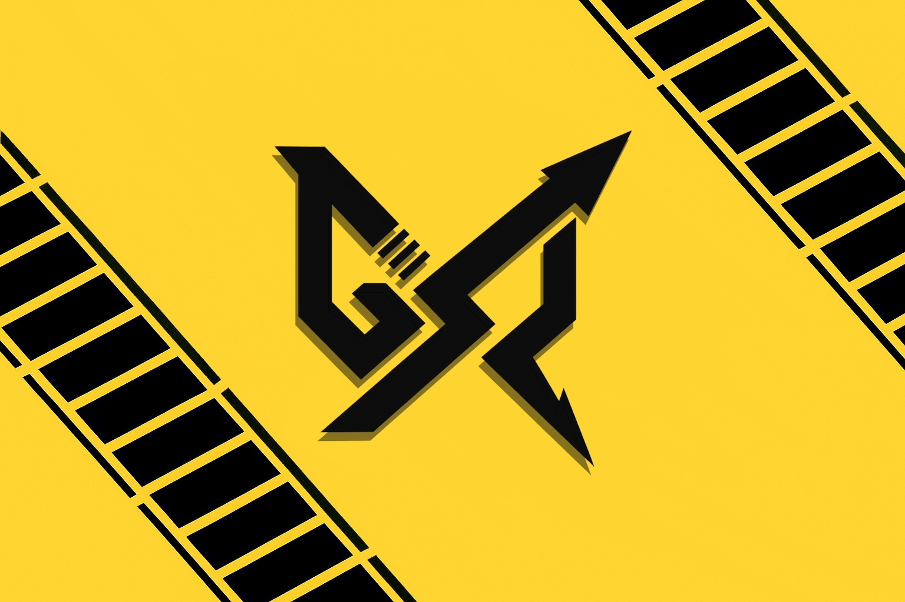

  <h1>GXR Blockchain</h1>
  <strong>A lightweight modular chain for the next generation of Web3 pioneers</strong> 
  <em>Powered by Cosmos SDK</em>

  
  
  

  
  
  <a href="https://github.com/Crocodile-ark/gxrchaind/actions/workflows/sims.yml">
    
  <a href="https://github.com/Crocodile-ark/gxrchaind/actions/workflows/lint.yml"> 
    

---

## 🌀 What is GXR?

**GXR (Gen X Raider)** is a fast, lightweight, and modular blockchain built on the Cosmos SDK. Designed for maximum efficiency and scalability, GXR powers community-driven applications with a focus on:

- 📉 Annual **Halving** Mechanism
- 💸 **Staking** and **Proof-of-Stake (PoS)** Rewards
- 🌱 Decentralized **Airdrop** and **Farming**
- ⚖️ On-chain **DAO Governance**
- 🔄 Built-in **Token Swap** and **Liquidity Farming**
- 💰 Fee Sharing for **LPs** and **Stakers**

GXR limits supply to 75 million tokens with fair distribution and long-term sustainability in mind. It offers simple modules, clean code, and real economic incentives — perfect for builders who want control without complexity.

---

## 🚀 Quick Start

Want to build on top of GXR?

Start by learning how Cosmos SDK works from a high-level view via the [Cosmos SDK Overview](https://docs.cosmos.network/main/intro/overview).

Then dive into tutorials here: [Cosmos SDK Tutorials](https://tutorials.cosmos.network) and customize them for your own GXR-based application.

---

## 🧱 Core Modules

GXR includes a lean set of modules for efficiency and clarity:

- Cosmos Standard: `auth`, `bank`, `staking`, `gov`, `distribution`
- Custom GXR Modules: `halving`, `swap`, `lp_reward`, `dao`

Each module is well-isolated and optimized for mobile and low-resource environments.

For details, check the [`x/`](./x/) folder.

---

## 🌐 IBC & Interoperability

GXR is fully compatible with the **Inter-Blockchain Communication (IBC)** protocol. Cross-chain swaps, bridges, and asset transfers are supported via [ibc-go](https://github.com/cosmos/ibc-go), allowing seamless connection with other Cosmos-based chains.

---

## 🔧 Developer Tools

Explore a rich set of community-built tools via [Awesome Cosmos](https://github.com/cosmos/awesome-cosmos).

Build, test, and launch your chain using:

- `ignite` scaffolding
- `tendermint` CLI tools
- Dockerized validator nodes
- Custom APIs and explorers

---

## ⚠️ Disclaimer

GXR is under active development. Expect frequent updates and improvements. Always use the latest stable Go version when building from source.

---

## ❓ Not That Cosmos

This project is not related to [React Cosmos](https://github.com/react-cosmos/react-cosmos). This note remains here as part of the naming agreement.

---

